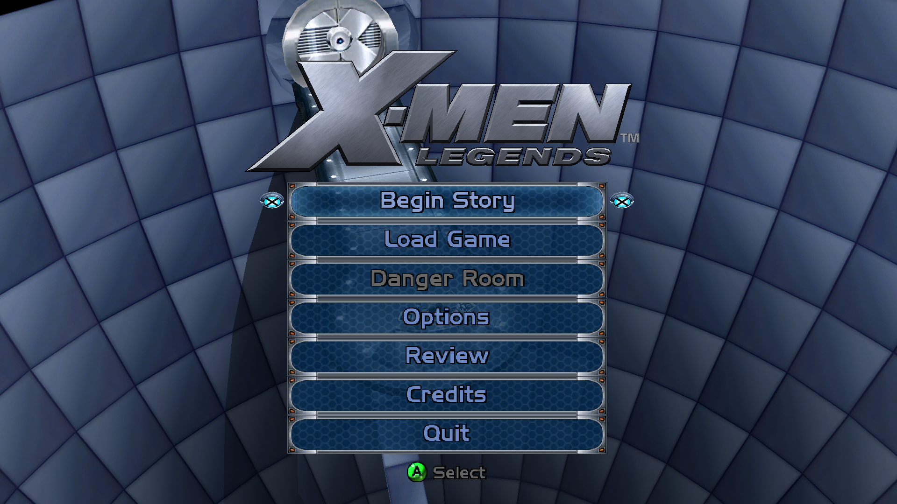
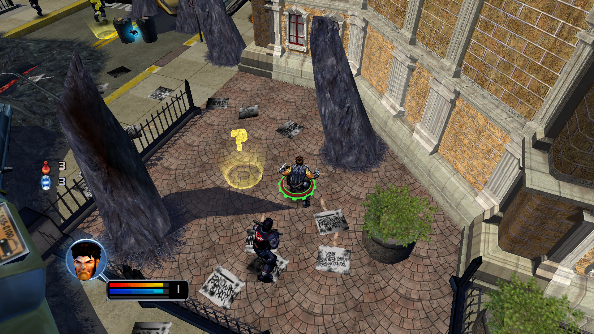
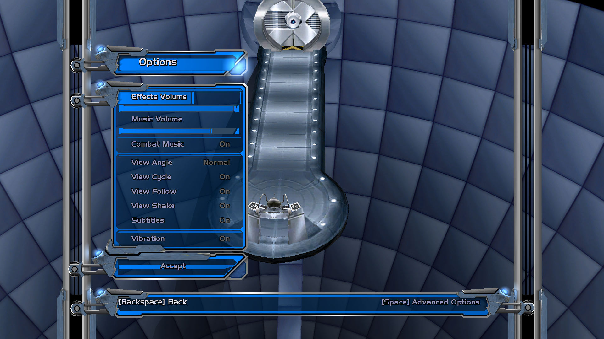
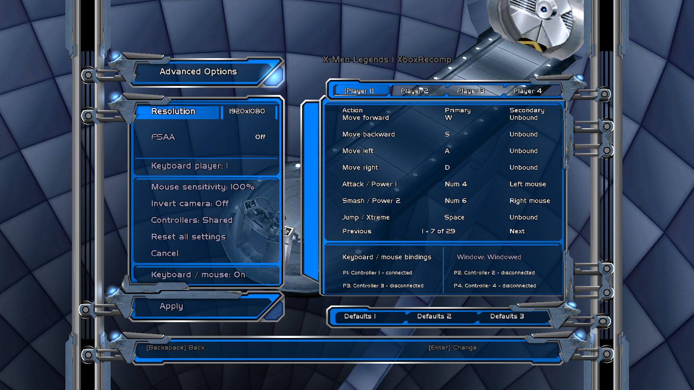

# OpenXML1xbox

A Windows recompilation of the original Xbox **X-Men Legends**, built with
[XboxRecomp](https://github.com/sp00nznet/xboxrecomp) and a native Windows
**Direct3D 8** renderer.

**[Download 0.8b prerelease](https://github.com/GTTeancum/OpenXML1xbox/releases/tag/0.8b)**

Version 0.8b is a beta for engine assessment. It reaches gameplay, supports
keyboard/mouse and XInput controls, and includes PC Options and Advanced Options
using XML2 menu assets recolored for XML1. Full-game compatibility and audio
fidelity are still being assessed.

<table>
  <tr>
    <td><br>Main menu</td>
    <td><br>1080p gameplay</td>
  </tr>
  <tr>
    <td><br>Options</td>
    <td><br>Advanced Options</td>
  </tr>
</table>

## Install the beta

Requires 64-bit Windows 10/11 and your own **X-Men Legends (World)** Xbox ISO.
The release does not include the ISO or the complete original game assets.

1. Extract the Xbox filesystem from your ISO into a writable folder using an
   Xbox ISO extraction tool. The folder must contain `default.xbe`, `media`,
   `movies`, `sounds`, and `z/assetsfb.zip` with their original paths.
2. Extract `OpenXML1xbox-0.8b-win64.zip` into that same folder, replacing the
   supplied files. Keep `runtime` and the hidden `.xml1-player-layout` file.
3. Launch **X-Men Legends.exe**. First-run setup extracts the archive into loose
   assets and generates PKGB manifests. It preserves the supplied modified menus.

The game executable prepares `assetsfb.zip`; it does **not** extract a raw ISO.
No Python, compiler, developer checkout, or separate launcher is needed to play.
The required x64/x86 Visual C++ runtime DLLs are bundled beside their respective
executables. The renderer uses Windows' system `d3d8.dll`.

The tested World ISO SHA-256 is:
`0a1ef03e57458144609906bbc2d44d2c26028cf704f4698ce0f1e61c34030b44`.

## Features and controls

- 1080p widescreen by default, adjustable display settings and live title-bar FPS.
- Native Options and Advanced Options, retaining the 3D menu or paused level.
- Rebindable keyboard/mouse and controller controls.
- WASD movement; left/right mouse attacks; Space jumps; E interacts.
- Middle mouse + drag, or V + drag, controls the camera. Esc pauses/resumes.
- Options > Space opens Advanced Options; Backspace returns to the previous menu.
- Main-menu Quit closes the application. Normal play has no session limit.

See the included `Read Me.txt` for the full default controls. Display and input
assignment changes require a restart. PC preferences are stored in
`pc-settings.ini`; original save data lives in `UDATA` and `TDATA`.

`build.ini` selects installed languages and asset loading. `PreferFilesLoose=1`
(or `true`) uses loose resources and PKGBs with **no archive fallback**. The new
PC menus were validated in English; localized PC menu adaptation is not complete.

## Validation and remaining work

The release payload was tested against a fresh World ISO extraction: first-run
preparation, startup/story movies, the 3D menu, level-one gameplay, movement,
pause/resume, restart, Options/Advanced and Quit. All 9,383 generated resources
and 35 supplied files passed the installation integrity check. Native captures
were inspected individually at 1920x1080.

These checks ran headless and muted. They do not establish audio fidelity,
physical device recovery, GUI setup appearance, or complete level/game coverage.
Multi-level multiplayer testing and sustained audio assessment remain open.
See [TODO.MD](TODO.MD) and [HD evidence](docs/HD-OUTPUT.md).

## Building from source

Development requires Git, Python 3.12, CMake and Visual Studio 2022 Desktop C++
tools. XboxRecomp and libsamplerate are pinned submodules; the setup script applies
our ordered toolkit patches.

```powershell
./scripts/setup.ps1
./scripts/build-toolkit.ps1
./scripts/import-iso.ps1 -IsoPath 'D:\path\to\X-Men Legends (World).iso'
./scripts/generate-code.ps1 -Disassemble
cmake -S . -B build/optimized -A x64 -DOPENXML1_BUILD_BOOT_PROBE=ON -DOPENXML1_OPTIMIZE_RECOMP=ON
cmake --build build/optimized --config Release --target xml1-boot-probe
cmake -S renderer -B build/renderer -A Win32
cmake --build build/renderer --config Release --target xml1-dx8-worker
```

The game host is 64-bit; the native DX8 renderer is a separate 32-bit process.
An original-Xbox hardware build is not implemented.
[PC menu documentation](docs/PC-OPTIONS-CONTROLS.md) covers the menu asset build,
which also requires locally installed XML2 reference assets and the IGB writer.
Original assets and generated game code remain outside Git.

This is an unofficial project, not affiliated with the original game's publishers
or developers. X-Men Legends and its artwork belong to their respective owners.
Third-party components retain their licenses and notices.
